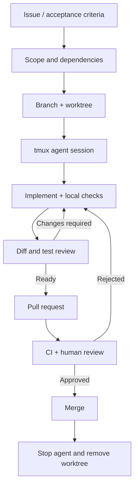

# Agent execution

```mermaid
flowchart TD
  Issue["Issue / acceptance criteria"] --> Scope["Scope and dependencies"]
  Scope --> Tree["Branch + worktree"]
  Tree --> Launch["tmux agent session"]
  Launch --> Implement["Implement + local checks"]
  Implement --> Review["Diff and test review"]
  Review -->|"Changes required"| Implement
  Review -->|"Ready"| PR["Pull request"]
  PR --> CI["CI + human review"]
  CI -->|"Rejected"| Implement
  CI -->|"Approved"| Merge["Merge"]
  Merge --> Cleanup["Stop agent and remove worktree"]
```

CLIが自動化するのはworktree作成とsession起動まで。
Issueの読解、実装、commit、PRは指示とプロジェクトの権限に従い、mergeは人間が行う。
会話履歴はAgent側の状態、成果の正本はGitとIssue/PRである。
