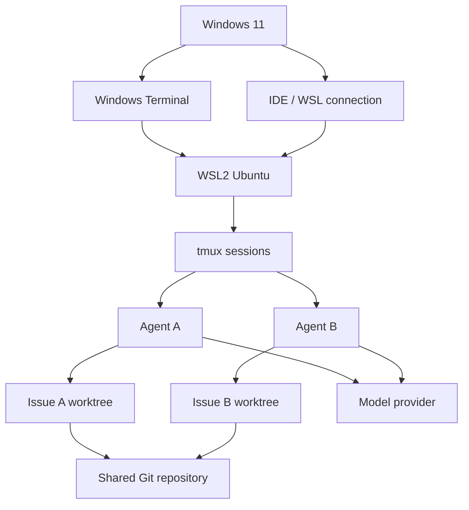

# Workstation topology

```mermaid
flowchart TD
  Windows["Windows 11"] --> Terminal["Windows Terminal"]
  Windows --> IDE["IDE / WSL connection"]
  Terminal --> WSL["WSL2 Ubuntu"]
  IDE --> WSL
  WSL --> Tmux["tmux sessions"]
  Tmux --> AgentA["Agent A"]
  Tmux --> AgentB["Agent B"]
  AgentA --> TreeA["Issue A worktree"]
  AgentB --> TreeB["Issue B worktree"]
  TreeA --> Git["Shared Git repository"]
  TreeB --> Git
  AgentA --> Provider["Model provider"]
  AgentB --> Provider
```

標準配置は`~/src/<repository>`と`~/worktrees/<repository>-<id>/issue-<number>`。
idはGit common directoryのパスから算出し、同名リポジトリの衝突を避ける。
IDEはWindows上のプログラムで、実行ターミナルはLinuxであることを確認する。
